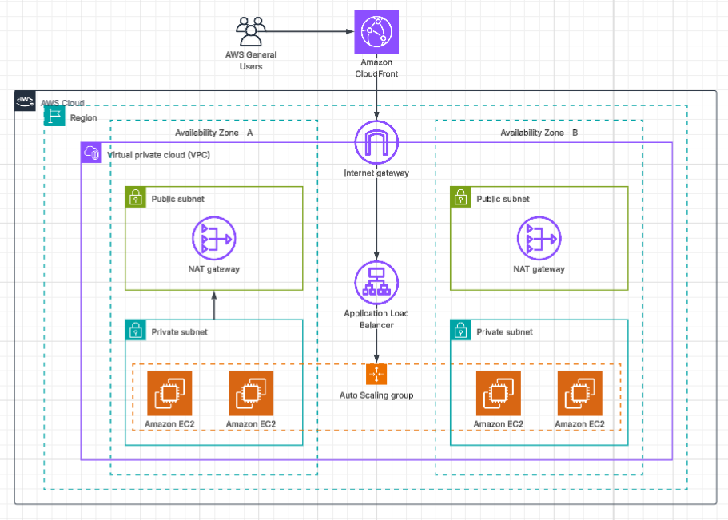

# Architecture Cloud Sécurisée avec Terraform

Ce projet déploie une infrastructure cloud sur AWS conçue selon les principes **Zero Trust** et **Defense in Depth**.

L’objectif est de construire une architecture **hautement disponible, sécurisée par défaut et scalable**, en éliminant toute exposition directe des ressources critiques.

---

## Architecture

<p align="center">
  
</p>

---

## Objectif

Construire une infrastructure :

* sécurisée par défaut (Zero Trust)
* sans exposition directe des ressources critiques
* résiliente (multi-AZ)
* auto-réparatrice (self-healing)
* conforme aux bonnes pratiques AWS en sécurité réseau

---

## Principes de sécurité implémentés

### Zero Trust

* Aucun accès implicite
* Aucun accès direct aux instances
* Tout trafic est explicitement autorisé

### Isolation réseau

* Instances uniquement en subnets privés
* Aucune IP publique sur les ressources critiques
* Pas d’accès entrant direct depuis Internet

### Contrôle du trafic

* Entrant : uniquement via cloudfront -> load balancer
* Sortant : uniquement via des NAT Gateways (pour les mises à jour)

### Defense in Depth

* Segmentation réseau (VPC / subnets)
* Filtrage via Security Groups
* Séparation des rôles (load balancer / compute)
* Distribution multi-AZ

---

## Composants

### Réseau

* Cloudfront
* VPC dédié
* 2 Availability Zones (pour la résilience)

Subnets publics :

* Application Load Balancer
* NAT Gateways

Subnets privés :

* Instances applicatives uniquement

* Tables de routage isolées par AZ

---

### Compute

* Launch Template :

  * Amazon Linux 2023
  * t3.micro

* Auto Scaling Group :

  * 3 instances
  * multi-AZ
  * self-healing automatique

---

### Load Balancing

* Application Load Balancer
* Target Group connecté à l’Auto Scaling Group

---

## Flux réseau

### Entrant

Internet → Cloudfront -> Load Balancer → instances privées

* Aucun accès direct aux instances
* Point d’entrée unique contrôlé

### Sortant

Instances → NAT Gateway → Internet

* utilisé uniquement pour mises à jour et dépendances
* isolation par zone

---

## Sécurité réseau

### Security Groups

Cloudfront : 
* Autorise HTTPS uniquement (443) depuis 0.0.0.0/0

Load Balancer :

* Autorise HTTP uniquement (80) depuis cloudfront

Instances :

* Autorise uniquement le trafic provenant du Security Group du Load Balancer
* Aucun accès SSH exposé

---

## Prérequis (première utilisation)

Avant de lancer le projet, assurez-vous d’avoir :

* Un compte AWS actif
* Un utilisateur IAM avec accès programmatique
* Un terminal Linux (ou WSL/Mac)

---

## Installation de Terraform (Linux)

```bash
sudo apt update
sudo apt install -y wget unzip

wget https://releases.hashicorp.com/terraform/1.7.5/terraform_1.7.5_linux_amd64.zip
unzip terraform_1.7.5_linux_amd64.zip
sudo mv terraform /usr/local/bin/

terraform -v
```

---

## Installation AWS CLI

```bash
sudo apt install awscli -y
aws --version
```

---

## Configuration AWS

### Option 1 – AWS CLI (recommandé)

```bash
aws configure
```

Renseigner :

* AWS Access Key ID
* AWS Secret Access Key
* Region (ex: us-east-1)
* Output format (json par défaut)

---

### Option 2 – Variables d’environnement (Linux)

```bash
export AWS_ACCESS_KEY_ID="your_access_key"
export AWS_SECRET_ACCESS_KEY="your_secret_key"
export AWS_DEFAULT_REGION="us-east-1"
```

Vérification :

```bash
aws sts get-caller-identity
```

---

## Configuration Terraform

Créer un fichier `terraform.tfvars` :

```hcl
region           = "us-east-1"
project_name     = "secure-architecture"
instance_type    = "t3.micro"
desired_capacity = 3
```

---

## Déploiement

```bash
terraform init
terraform plan
terraform apply
```

---

## Vérification

1. Récupérer l’URL DNS du Load Balancer (output Terraform)
2. Ouvrir dans un navigateur
3. Rafraîchir plusieurs fois

Résultat attendu :

* hostname différent
* changement de zone (preuve du multi-AZ et du scaling)

---

## Nettoyage

```bash
terraform destroy
```

Important :
Les NAT Gateways et Elastic IP génèrent des coûts si non supprimés.

---

## Structure du projet

```
.
├── network/        # VPC, subnets, NAT, routing
├── security/       # Security Groups
├── compute/        # Launch Template + Auto Scaling Group
└── loadbalancer/   # Load Balancer + Target Group
```

---

## Points forts sécurité

* Architecture Zero Trust
* Aucune exposition directe des instances
* Segmentation stricte public / privé
* Filtrage réseau minimal (least privilege)
* Haute disponibilité sans compromis sécurité
* Infrastructure reproductible (Infrastructure as Code)

---

## Évolutions possibles

* HTTPS (certificats TLS)
* Intégration d’un Web Application Firewall
* Accès sécurisé via Session Manager
* Centralisation des logs et monitoring
* Politiques IAM en least privilege avancé

---

## Conclusion

Ce projet démontre la mise en place d’une infrastructure AWS :

* sécurisée par défaut
* hautement disponible
* scalable
* alignée avec les standards modernes de sécurité cloud

Il constitue une base solide pour des environnements orientés **Cloud Security Engineering**.
